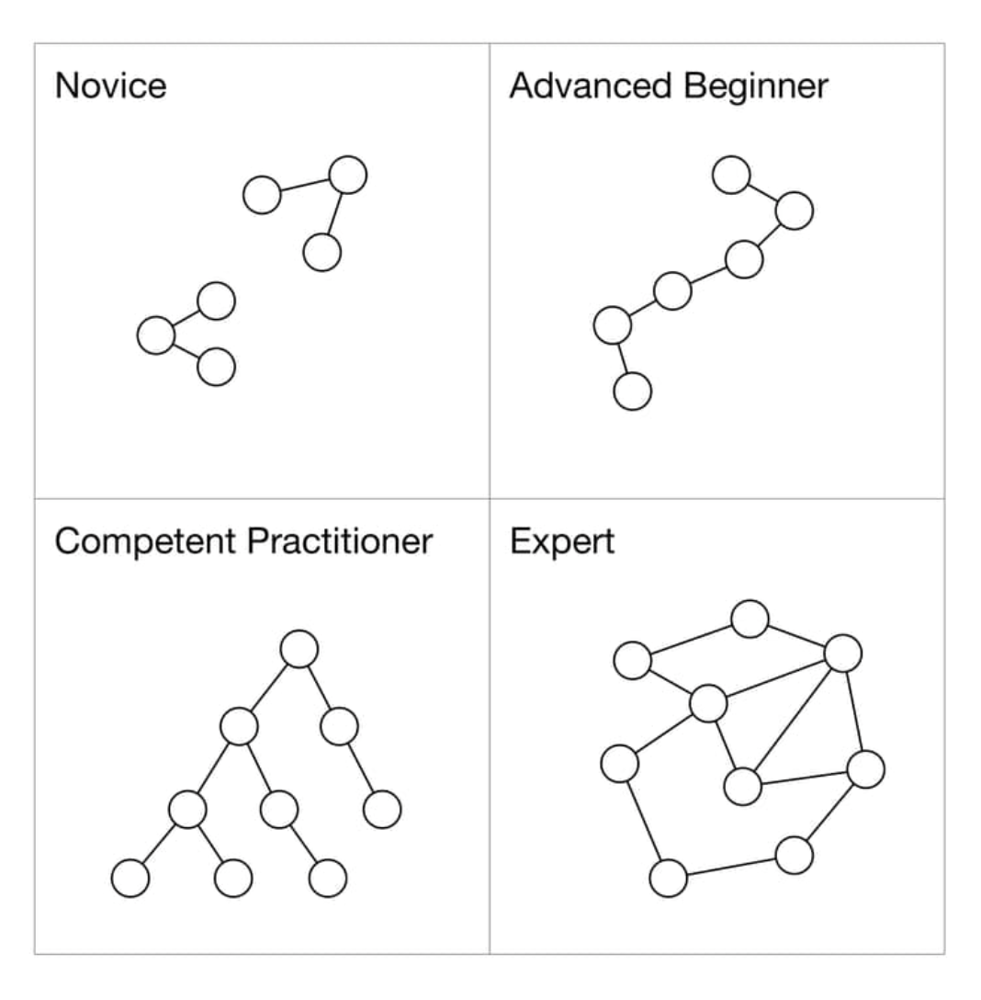
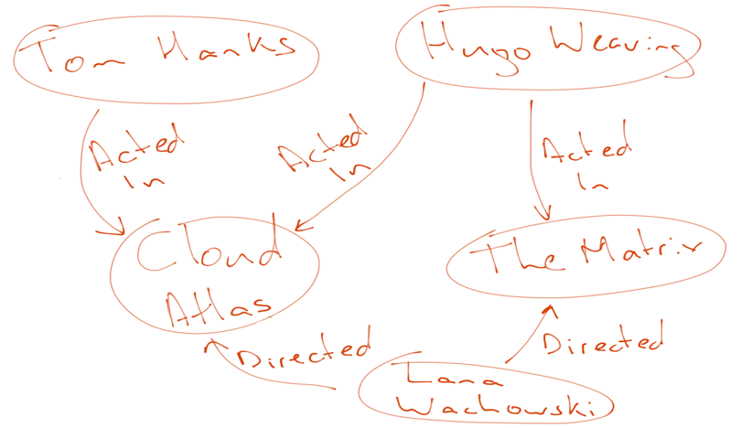
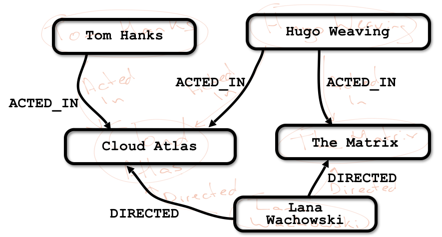
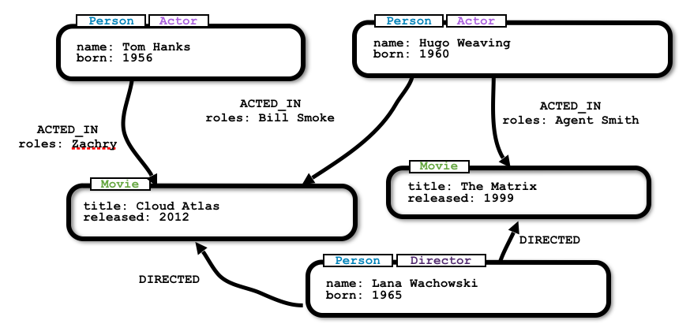
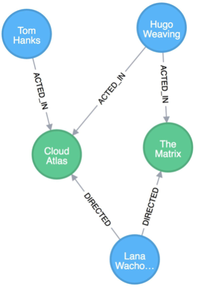

# 手把手快速上手图数据建模

2022-04-20


欢迎来到新的一篇手把手快速上手，本期的内容是图数据建模。

## 为什么需要数据建模？

本文是针对没有数据库经验的初学者，如果你熟悉关系数据库的数据建模，可以直接读图数据建模和ER模型的对比部分。

要利用软件来处理现实的问题，我们需要将现实问题跟软件系统对应起来，而且计算机的系统的资源是有限的，我们需要将特定问题的领域转换到软件系统和数据中。

### 什么是数据建模

数据建模是核心的数据管理任务。据说最早的数据建模是面向业务人员的，帮助他们理解和描述业务流程和规则等等，但随着关系模型和规范化的出现，数据建模成为软件工程中技术含量很高的一部分。

数据建模是一个定义数据需求的过程，由业务专家和软件架构师、数据库管理员DBA甚至更多成员一起来参与完成。最终目标是实现软件系统能够反映和解决现实问题。

### 数据建模的种类

一般有3种数据模型：**概念数据模型**、**逻辑数据模型**和**物理数据模型**。

概念数据模型反映业务或分析的流程，从概览的层面列出了数据的需求和业务规则。

逻辑数据模型关注数据之间的关联，从技术角度描述数据，帮助数据库专业人员理解业务需求和决定软件系统设计。

物理数据模型是指特定于数据库管理系统的结构模型，关系数据库使用表、列、主键外键索引等来存储数据，图数据库使用无邻接索引等来存储。

### 数据建模方式

常见的建模方式有**实体关系模型**（ERD，Entity Relationship Diagram）、**维度建模**（适用于传统数据仓库）和**图数据建模**等。

不要被这么多概念吓到。随着知识图谱、数据融合、图数据科学等的兴起，图数据建模是一种优于传统数据建模的技术，适用于关系和图、文档、键值等等场景，利用认知心理学来改进大数据的设计。

使用图数据建模非常容易，不需要有数据库设计经验就可以开始，准备好白板和笔了吗？任何电子白板也都可以。

## 标签属性图模型

这可能是你开始进行图数据建模需要掌握的唯一一个概念了：标签属性图（Labeled Property Graph）模型。

我们知道，图是用节点（Vertex或Node）和边（Edge）或关系（Relationship）来表示的，在属性图模型中，可以为节点和边添加属性来表示更多的数据，还可以给节点和边打上标签来表示不同的类别。

还记得图的边是可以有方向的对吗？

以上就是标签属性图模型的概念了，学会了吗？


在Neo4j中，数据按照节点（Node）和关系（Relationship）来组织。再加上属性（Property）和标签（Label）就构成了图数据建模的基础知识。

## 回顾一下图思考（Graph Thinking）

在之前的文章中，我简单介绍了使用小工具掌握图思考（或图思维），我介绍了**“关系”**在我们日常思考中无处不在，如果你开始使用这样的方式去画一些关系图，是不是会像下图的某种呢？



其实上图是我最近在读的一本书里的，书中讲了不同水平的人在学习知识的时候，对于知识点的关联程度不同。但我觉得特别适合说明我们进行图思考的情况：最开始只能简单的画一些关联关系，然后可能画出一些链条，再然后才是复杂的关系网。

## 图数据建模指南

既然准备好了白板和了解图思考，我们开始吧。

请忘掉概念模型和逻辑模型吧，图数据模型的优势在于同时支持业务和数据库专业人员。

### 第一步：白板模型

我们以电影数据集为例子，直接在白板上画出事物和它们之间的关系。



这有点粗糙，我们换一个方式：



这就是**电影**和**人物**以及**他们之间的关系**的直观表达。

还记得我们用的**标签属性图**模型吗？

### 第二步：添加标签和属性



属性是用键值对的方式存储数据，支持多种数据类型。

### 第三步：在Neo4j中查看数据

在我们的Cypher快速上手里介绍了基本的语法，你可以尝试着把模型里的数据手动创建到数据库里。然后运行查询，我们就能看到这样的结果：



怎么样，实际存储的数据也很直观。

这就是图数据库的魅力。

## 总结

这也太简单了吧！

本指南只是使用简单、直接的场景介绍图数据建模。目标是让你可以开始进行建模和创建数据。开始实战吧。

每个数据模型都是独一无二的，具体取决于用例和用户需要用数据回答的问题类型。因此，没有“一刀切”的数据建模方法。使用最佳实践和不断试错将得到更准确的数据模型，得益于Neo4j的无模式（Schemaless）设计，你可以灵活修改数据模型。

创建数据的Cypher脚本如下：

```cypher
CREATE (tom:Person:Actor{name:'Tom Hanks', born:1956})
CREATE (cloudAtlas:Movie{title:'Cloud Atlas', released:2012})
CREATE (lana:Person:Director{name:'Lana Wachowski', born:1965})
CREATE (theMatrix:Movie{title:'The Matrix', released:1999})
CREATE (hugo:Person:Actor{name:'Hugo Weaving', born:1960})
CREATE (tom)-[:ACTED_IN{roles:'Zachry'}]->(cloudAtlas)
CREATE (lana)-[:DIRECTED]->(cloudAtlas)
CREATE (lana)-[:DIRECTED]->(theMatrix)
CREATE (hugo)-[:ACTED_IN{roles:'Bill Smoke'}]->(cloudAtlas)
CREATE (hugo)-[:ACTED_IN{roles:'Agent Smith'}]->(theMatrix)
```

### 参考资源

https://neo4j.com/developer/data-modeling/

