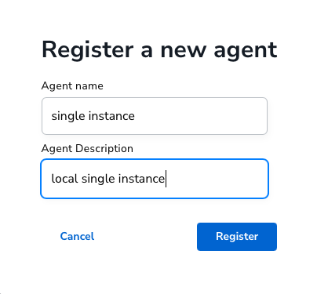
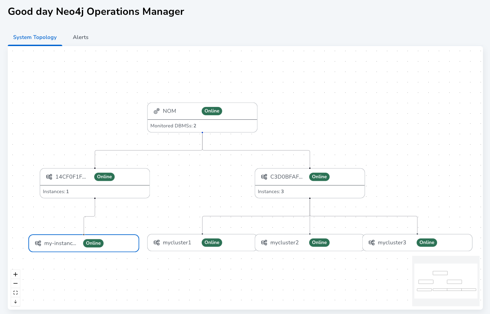
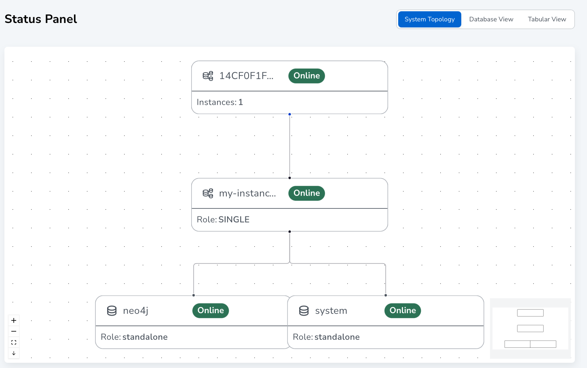
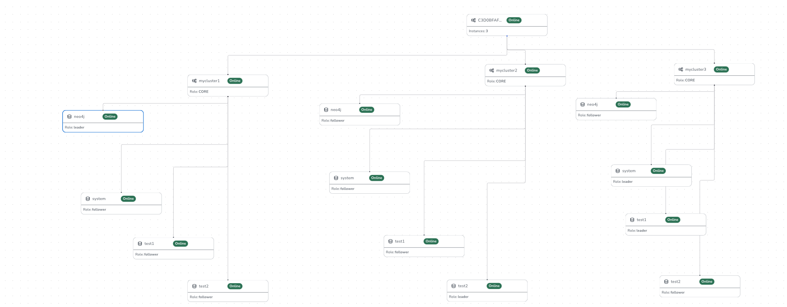
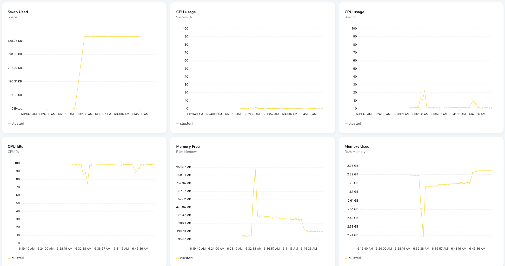
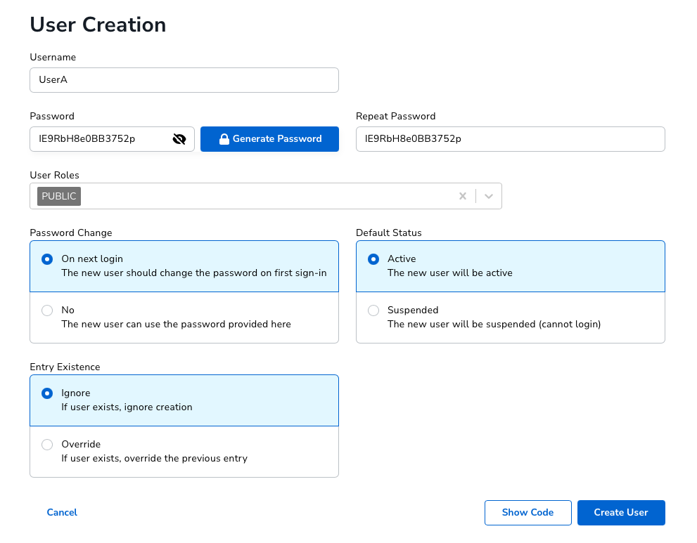
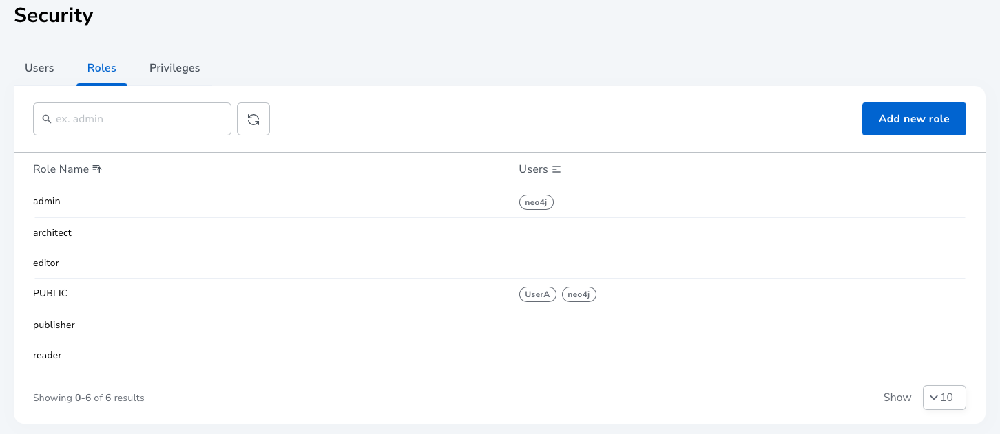

# 利用Neo4j Ops Manager 监控管理数据库

近来，包括 Neo4j 在内的图形数据库正在迅速成长，随着数据库规模的增加，这些数据库更普遍地部署到集群部署中。客户部署正在从自我管理的本地部署过渡到云和混合安装。随着所有这些变化，DBA、DevOps 和 IT 领导者面临着更大的压力，即通过专注于提高生产力按时、按预算交付应用程序。

Neo4j 的监控和管理是使用本地命令行工具或通过 cypher-shell 或浏览器公开的密码来执行的。通过集成第 3 方工具可以实现监控，需要单独的安装、许可和部署以及维护。这些解决方案都没有原生地暴露 Neo4j 上下文，并且没有一个地方可以监控、管理和操作客户的整个 Neo4j 资产。

Neo4j Ops Manager（缩写为 NOM）是一种工具，用于帮助 Neo4j DBMS 部署的管理员并解决这一差距。它包含当前和未来的功能，允许管理员在其资产范围内监控、管理和操作这些部署。

NOM 建立在旨在支持多个 DBMS 实现（包括单实例和集群）的核心架构之上。该架构包含用于智能监控和知识引擎的元数据驱动的可扩展框架。借助这些功能，NOM 是否有可能不仅帮助管理员了解正在发生的事情，而且了解它发生的原因，并通过可解释的洞察力提出建议来解释如何处理它。在此架构和框架之上是一组“管理器”，涵盖监控、管理、运营和集成四大支柱。

本文介绍如何搭建Neo4j Ops Manager 并实现对单个实例，或者集群实例的监控和管理。

## 系统需求说明

NOM 服务器和代理可以通过从 Neo4j 下载中心下载它们各自的包并将它们放置在您想要运行它们的机器上来安装。 Nom 服务器设计为在受 TLS 保护的通道上运行。 因此，您需要准备证书和私钥来保护服务器-代理通信。 所有代理安装都需要使用相同的证书。
NOM 服务器
•	Java 17
•	用于 TLS 保护的端点的密钥对和证书（作为 PKCS12 文件）。
持久性 DBMS：
•	Neo4j 4.4 企业版
•	至少 10 GB 可用磁盘空间
•	有关最低要求，另请参阅操作手册 → 系统要求。
https://neo4j.com/docs/ops-manager/installation/prerequisites/
•	NOM 附带运行 Neo4j DBMS 的许可证，该数据库具有多达 4 个 CPU 内核和多达 16 GB 的 RAM，可用作 NOM 的持久性存储。

## 安装配置

说明：本文仅将服务器和代理运行在控制台应用模式，如果需要安装成服务，参考下面的链接
https://neo4j.com/docs/ops-manager/installation/server/

### 步骤1: 服务器环境准备

本文采用Mac OS 做为测试服务器，安装配置OpenJDK 17.0.2，下载解压neo4j-ops-manager-server-1.0.0 (下载链接：https://neo4j.com/download-center/)。
安装Neo4j 4.4.x作为永久存储数据库存储NOM元数据。

### 步骤2: 生成自解压证书

使用OPENSSL 生成自解压证书，本文使用Mac OS，可以参考下面的文档链接。
https://crimsonpinnacle.com/cloud-knowledge-base/security-and-compliance/creating-a-self-signed-certificate-on-mac-os-x/

### 步骤3: 配置代理客户端

拷贝.crt文件到目标服务器，并在目标服务器端下载Ops Manager Agent。

### 步骤4: 运行服务器端命令或者启动服务

服务器端执行命令行
java -jar ./lib/server.jar 
--spring.neo4j.uri=neo4j://localhost:7687
--spring.neo4j.authentication.username=neo4j 
--spring.neo4j.authentication.password=SUPERPASSWORD 
--server.port=8080 
--server.ssl.key-store-type=PKCS12 
--server.ssl.key-store=file:./certificates/tonywu-self-signed.key.pfx 
--server.ssl.key-store-password= SUPERPASSWORD 
--grpc.server.port=9090 
--grpc.server.security.key-store-type=PKCS12 
--grpc.server.security.key-store=file:./certificates/my-self-signed.key.pfx 
--grpc.server.security.key-store-password= SUPERPASSWORD 
--jwt.secret=please-set-a-random-secret-string-here-for-jwt-signing

其中，neo4j://localhost:7687为永久性存储Neo4j 连接, 以及相应的有写权限的用户名和密码；8080为管理服务器端口号，9090为客户代理和服务通信端口。
服务器启动后，可以输入初始用户名和密码， admin 以及passw0rd登入系统，注册并生成代理token信息

### 步骤5: 配置代理客户端

记录上一步的token信息，并在代理客户端设置环境变量，如下所示。其中前4行为注册代理时候记录的token和服务器信息。

export CONFIG_SERVER_ADDRESS=server_IP:9090
export CONFIG_TOKEN_URL=https://server_IP:8080/api/login/agent
export CONFIG_TOKEN_CLIENT_ID=3c8e4bb1-588d-4179-b58f-ca1c4ed84f9e
export CONFIG_TOKEN_CLIENT_SECRET=B2CWqzvgG1OlJSql5wyMbJQZyoxpEkDzW5Ovjb6JDCnRpLfgVVAqpFPZVoP6rfDL

// 下面为代理客户端的数据库连接信息
export CONFIG_INSTANCE_1_BOLT_URI=bolt://localhost:7687
export CONFIG_INSTANCE_1_BOLT_USERNAME=neo4j
export CONFIG_INSTANCE_1_BOLT_PASSWORD=SUPERPASSWORD

//下面为实例名称和证书位置信息
export CONFIG_INSTANCE_1_NAME=my-instance-1
export CONFIG_TLS_TRUSTED_CERTS=./tonywu-self-signed.key.crt

### 步骤6: 启动代理

在客户端启动代理，可以监控代理运行状态
bin/agent console

2022-07-04T14:43:59+08:00 | WARN  | Successfully started agent
2022-07-04T14:43:59+08:00 | WARN  | Version: 1.0.0
2022-07-04T14:43:59+08:00 | WARN  | Revision: 78b69585eb09a4707a055b92614b5b94adf98d1e

成功连接代理客户端后，在服务器端可以看到连接信息和代理版本信息。

## 监控管理
1.	主监控视图
下面是主监控视图，可以直观显示所有连接的实例和活动状态（在线或者离线），本例子中有两个代理注册，其中一个是单实例，另外一个是3个节点的集群。

2.	单实例视图
通过主界面上方的下拉菜单可以切换不同的注册代理，显示相应的单实例或集群注册。例如，下图显示单实例以及相应的数据库状态。
 

3.	集群实例
集群上每个实例都需要单独运行代理，需要用不同的实例号区别不同的实例，如在客户端输出下面的环境变量，用INSTANCE_n 表示不同的实例。

export CONFIG_INSTANCE_1_NAME=mycluster2
export CONFIG_INSTANCE_1_BOLT_URI=bolt://localhost:7688
export CONFIG_INSTANCE_1_BOLT_USERNAME=neo4j
export CONFIG_INSTANCE_1_BOLT_PASSWORD=Ne04j!

下面是集群实例状态。
 
下图显示集群数据库状态以及相应的角色(leader 或者follower)。

也可以通过数据库拓扑图显示实例和数据库状态。

也可以用表格方式显示。

4.	监控主机，实例和数据库信息
通过仪表板显示主机，实例以及数据库的监控信息，下图为主机的监控信息，包括CPU，内存等信息。

5.	创建用户并赋予角色
用户可以创建新的用户并赋予内建的角色。
 

6.	升级建议
此外 Ops Manager提供了升级建议, 您可以查看并选择下载需要升级的版本。

## 结语

Neo4j Ops Manager 是一个基于 UI 的工具，它使 DBA（或任何管理员）能够监控、管理和操作企业中的所有 Neo4j DBMS。

虽然 NOM 最初包含一小部分功能，但它将继续以三种方式添加功能。
 * 增强：向现有组件添加更好的功能/新功能以改善用户体验 
*  扩展：在四个支柱中的每一个支柱中添加新的管理器提供额外的能力 
*  丰富：通过使用框架添加可操作的见解和建议，为监控管理增加价值

更多资源请参考https://neo4j.com/docs/ops-manager/。
